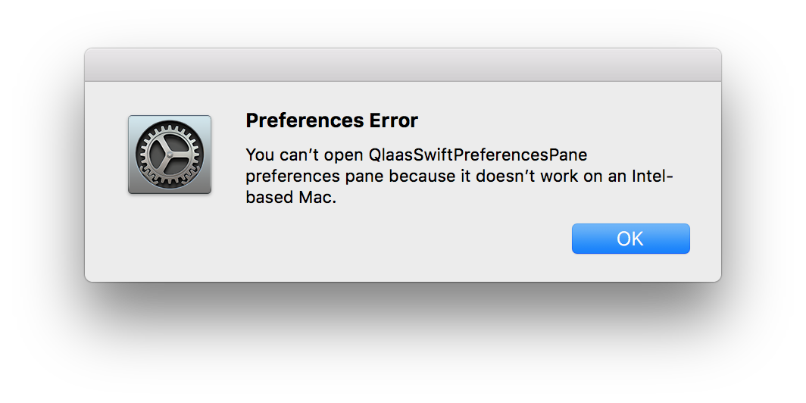

This is a simple demo project to show that Preferences Panes programmed in Swift 4 will not work when used in macOS High Sierra. Related and similar to <https://github.com/klaas/QlaasSwiftScreenSaver>.

## Error description:

As soon as you click on the icon of the QlaasSwiftPreferencesPane within the System Preferences, an error window will come up:

Accompanied by an error message in the Console app:

	Error loading /Users/klaas/Library/PreferencePanes/QlaasSwiftPreferencesPane.prefPane/Contents/MacOS/QlaasSwiftPreferencesPane:
	dlopen(/Users/klaas/Library/PreferencePanes/QlaasSwiftPreferencesPane.prefPane/Contents/MacOS/QlaasSwiftPreferencesPane, 265):
	can't resolve symbol _OBJC_CLASS_$_NSError in /Users/klaas/Library/PreferencePanes/QlaasSwiftPreferencesPane.prefPane/Contents/
	MacOS/../Frameworks/libswiftCore.dylib because dependent dylib #1 could not be loaded in /Users/klaas/Library/PreferencePanes/
	QlaasSwiftPreferencesPane.prefPane/Contents/MacOS/../Frameworks/libswiftCore.dylib

